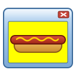

<div align="center">



### A ticket manager on your own computer, with the look of Windows 7

_One native window, one SQLite file, no server, no account_


[](LICENSE)
[](https://github.com/Stiven-Gjekaj/HotDogStand/releases/latest)

<p align="center">
  <a href="#overview"><b>Overview</b></a> |
  <a href="#features"><b>Features</b></a> |
  <a href="#quick-start"><b>Quick Start</b></a> |
  <a href="docs/architecture.md"><b>Architecture</b></a> |
  <a href="TODO.md"><b>Roadmap</b></a>
</p>

</div>

---

> [!NOTE]
> **The first version is in progress.**
> [TODO.md](TODO.md) shows each step and which steps are done.
> [docs/architecture.md](docs/architecture.md) holds the plan and the reason
> for each decision.

---

## Overview

**HotDogStand** keeps your tickets: the bugs, the requests, and the work that
is not done. It is a native desktop application for Windows, macOS, and Linux.
It keeps the data in one SQLite file on your computer. It does not start a
server, it does not connect to the network, and it does not use a webview.

It looks like a desktop from 2009. The tickets are in a list view in a glass
window. A double click opens a ticket in its own window. You can open many
tickets at the same time.

When you want the data somewhere else, export it to JSON or CSV.

The name comes from "Hot Dog Stand", the red and yellow color scheme of
Windows 3.1. HotDogStand ships it as a theme.

## Features

<table>
<tr>
<td width="50%" valign="top">

### Tickets

- Create, edit, assign, comment on, close, and reopen a ticket
- A title, a description in Markdown, a status, a priority, an assignee, and
  labels
- A history that shows what changed, and when
- Export the full workspace to JSON, or the list to CSV

</td>
<td width="50%" valign="top">

### The windows

- A list view that sorts by each column and filters by each field
- A window for each ticket, with its own button on the taskbar
- Glass frames, Aero controls, and the Selawik font
- Two themes: Aero, and Hot Dog Stand

</td>
</tr>
</table>

## Quick Start

This section shows the plan. The commands do not work yet.

You need [Rust](https://rustup.rs). The repository pins the version of the
toolchain, and `rustup` installs it.

```
git clone https://github.com/Stiven-Gjekaj/HotDogStand
cd HotDogStand
cargo run --release
```

The first start makes the workspace file in the data directory of your
system. [docs/architecture.md](docs/architecture.md#data-model) says where.

## Your data

The workspace is one file on your computer. Nothing reads it except
HotDogStand, and nothing sends it anywhere. To make a backup, copy the file
or export it to JSON. To share tickets with another person, send them an
export.

## Documentation

| Document | What it holds |
| -------- | ------------- |
| [docs/architecture.md](docs/architecture.md) | The parts, the data model, the styling, and the reasons |
| [TODO.md](TODO.md) | What is not built yet |
| [CONTRIBUTING.md](CONTRIBUTING.md) | How to help |
| [SUPPORT.md](SUPPORT.md) | Where to ask a question |
| [SECURITY.md](SECURITY.md) | How to report a security problem |

## Not affiliated with Microsoft

HotDogStand copies a look. It is not a product of Microsoft, and Microsoft
does not support it. Windows is a trademark of Microsoft Corporation. The
project uses no icon, wallpaper, logo, or sound from Windows. The font,
Selawik, is an open font that Microsoft publishes under the SIL Open Font
Licence.

## License

The code is MIT. See [LICENSE](LICENSE). The application uses Slint under the
Slint Royalty-free Licence. See [TERMS.md](TERMS.md).
