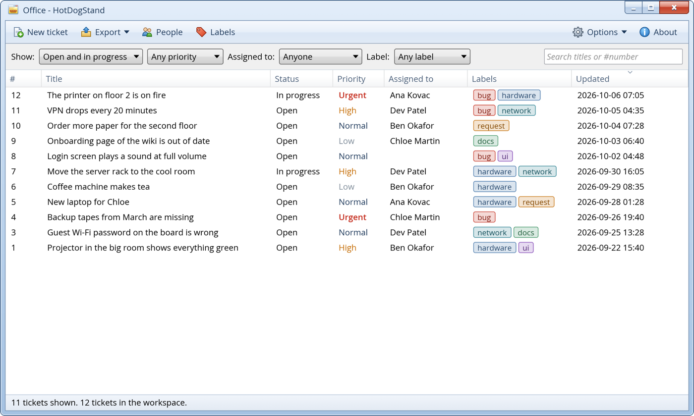
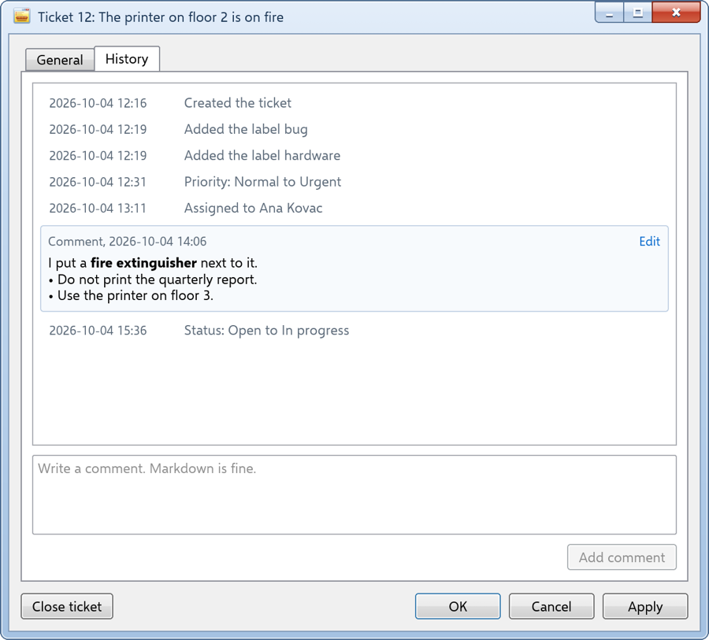
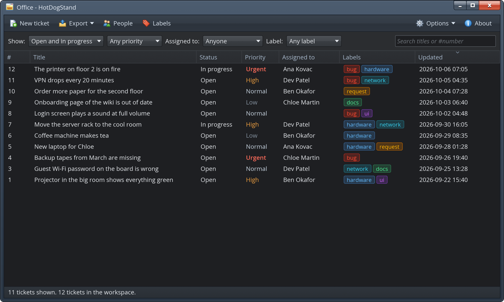
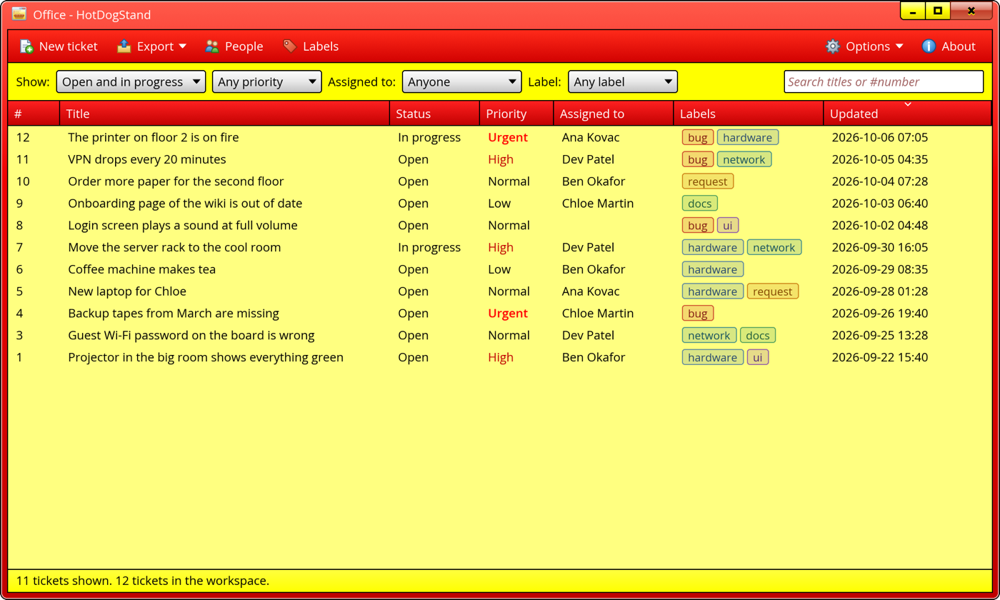

<div align="center">


### A ticket manager on your own computer, with the look of Windows 7

_One native window, one SQLite file, no server, no account_


[](LICENSE)
[](https://github.com/Stiven-Gjekaj/HotDogStand/releases/latest)

<p align="center">
  <a href="#overview"><b>Overview</b></a> |
  <a href="#features"><b>Features</b></a> |
  <a href="#quick-start"><b>Quick Start</b></a> |
  <a href="docs/architecture.md"><b>Architecture</b></a> |
  <a href="TODO.md"><b>Roadmap</b></a>
</p>

</div>

---

> [!NOTE]
> **Version 0.1.0 is out.**
> [Install](#install) says how to get it, and [CHANGELOG.md](CHANGELOG.md)
> says what it holds.
> [TODO.md](TODO.md) lists the known problems and the measurements.
> [docs/architecture.md](docs/architecture.md) holds the plan and the reason
> for each decision.

---

<p align="center">
  
</p>

## Overview

**HotDogStand** keeps your tickets: the bugs, the requests, and the work that
is not done. It is a native desktop application for Windows, macOS, and Linux.
It keeps the data in one SQLite file on your computer. It does not start a
server, it does not connect to the network, and it does not use a webview.

It looks like a desktop from 2009. The tickets are in a list view in a glass
window. A double click opens a ticket in its own window. You can open many
tickets at the same time.

When you want the data somewhere else, export it to JSON or CSV.

The name comes from "Hot Dog Stand", the red and yellow color scheme of
Windows 3.1. HotDogStand ships it as a theme.

## Features

<table>
<tr>
<td width="50%" valign="top">

### Tickets

- Create, edit, assign, comment on, close, and reopen a ticket
- A title, a description in Markdown, a status, a priority, an assignee, and
  labels
- A history that shows what changed, and when
- Export the full workspace to JSON, or the list to CSV

</td>
<td width="50%" valign="top">

### The windows

- A list view that sorts by each column and filters by each field
- A window for each ticket, with its own button on the taskbar
- Glass frames, Aero controls, and the Open Sans font
- Two themes, Aero and Hot Dog Stand, each with a dark form
- On macOS, the menus are in the menu bar of the system

</td>
</tr>
</table>

## Screenshots

<table>
<tr>
<td width="50%" valign="top">

<p align="center"><i>The history of a ticket, with a comment in Markdown</i></p>
</td>
<td width="50%" valign="top">

<p align="center"><i>The dark form of Aero</i></p>

<p align="center"><i>Hot Dog Stand</i></p>
</td>
</tr>
</table>

The screenshots show the application with the workspace that
`cargo run -p hds-store --example demo -- demo.db` makes.

## Quick Start

You need [Rust](https://rustup.rs). The repository pins the version of the
toolchain, and `rustup` installs it.

```
git clone https://github.com/Stiven-Gjekaj/HotDogStand
cd HotDogStand
cargo run --release
```

The first start makes the workspace file in the data directory of your
system. [docs/architecture.md](docs/architecture.md#data-model) says where.

## Install

With a package manager:

| System | Command |
| ------ | ------- |
| macOS | `brew install --cask --no-quarantine stiven-gjekaj/tap/hotdogstand` |
| Windows, Scoop | `scoop bucket add stiven-gjekaj https://github.com/Stiven-Gjekaj/scoop-bucket` then `scoop install stiven-gjekaj/hotdogstand` |
| Windows, winget | `winget install Stiven-Gjekaj.HotDogStand`, after Microsoft accepts the package |

Or download the file for your system from the
[latest release](https://github.com/Stiven-Gjekaj/HotDogStand/releases/latest).

| System | File | Install |
| ------ | ---- | ------- |
| Windows | `HotDogStand-windows-x86_64.zip` | Unzip it and start `HotDogStand.exe`. |
| macOS | `HotDogStand-macos-universal.zip` | Unzip it and move `HotDogStand.app` to `/Applications`. It runs on Apple silicon and on Intel. |
| Linux | `HotDogStand-linux-x86_64.tar.gz` | Unpack it and run `scripts/install-linux.sh` in it. |

The packages are not signed, so the system warns before the first start:

- **Windows.** SmartScreen says that it protected your PC. Click "More info",
  then "Run anyway".
- **macOS.** Gatekeeper refuses to open the application. Open it once with a
  right click and "Open", or run
  `xattr -dr com.apple.quarantine /Applications/HotDogStand.app`.

### Build it yourself

Build the application, then install it in the way of your system, so that it
has its icon and its name.

| System | Command | Result |
| ------ | ------- | ------ |
| macOS | `./scripts/bundle-macos.sh` | `target/release/HotDogStand.app`. Copy it to `/Applications`. |
| Linux | `cargo build --release && ./scripts/install-linux.sh` | The program in `~/.local/bin`, and an entry with the icon in the menu of applications. |
| Windows | `cargo build --release` | `target\release\hotdogstand.exe`, with the icon in it. |

## Your data

The workspace is one file on your computer. Nothing reads it except
HotDogStand, and nothing sends it anywhere. To make a backup, copy the file
or export it to JSON. To share tickets with another person, send them an
export.

## Documentation

| Document | What it holds |
| -------- | ------------- |
| [docs/architecture.md](docs/architecture.md) | The parts, the data model, the styling, and the reasons |
| [TODO.md](TODO.md) | What is not built yet |
| [CONTRIBUTING.md](CONTRIBUTING.md) | How to help |
| [SUPPORT.md](SUPPORT.md) | Where to ask a question |
| [SECURITY.md](SECURITY.md) | How to report a security problem |

## Not affiliated with Microsoft

HotDogStand copies a look. It is not a product of Microsoft, and Microsoft
does not support it. Windows is a trademark of Microsoft Corporation. The
project uses no icon, wallpaper, logo, or sound from Windows. The font, Open
Sans, is under the SIL Open Font Licence.

## License

The code is MIT. See [LICENSE](LICENSE). The application uses Slint under the
Slint Royalty-free Licence. See [TERMS.md](TERMS.md).
